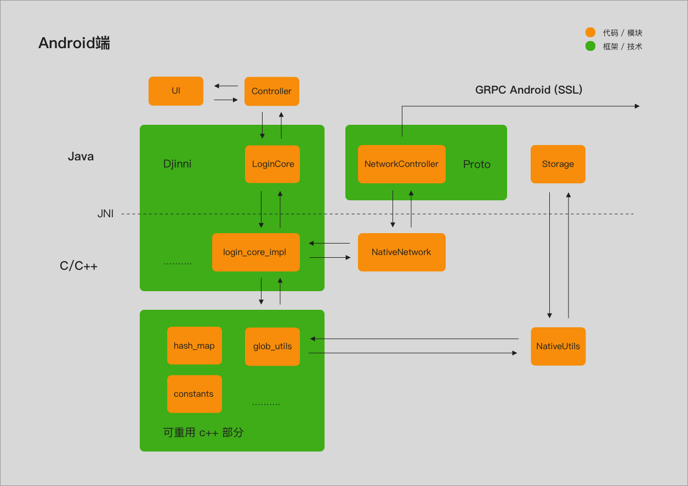
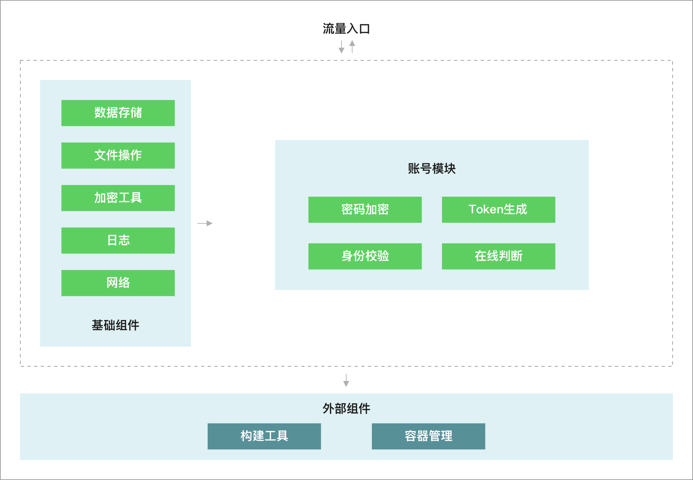

# 单终端登录系统

## 功能简介

1. 具备注册登录功能
2. 一个⽤户只能在一个设备上登录，切换终端登录时，其他已登录的终端会被踢出

## 技术简介

- 客户端用Android实现，采用Djinni实现跨平台开发（Android & IOS with C++）
- 后台用C++实现
- 采用GPRC进行远程通信，自己生成非对称密钥（crt\key\pem），使用SSL进行数据传输加密
- 采用Bazel构建后台项目，以及依赖管理
- 采用Docker部署项目，并使用Docker Compose编排容器

## 项目图示

## 开发过程

为期20天，01-22 ~ 02-10

### 1.22

理解需求，拆分任务

初步判断每一块技术需要的时间，制定工作计划

1. C++ (每一天学习)
2. Djinni（4天）
3. GRPC & ProtoBuffer（4天）
4. Bazel（4天）
5. Docker & Docker Compose（3天）

### 1.23-1.26

学习Djinni，并跑通一个demo

过程：
根据官网说明生成相关cpp，配置正确，生成文件已导入，但是运行不起来，错误信息很模糊，报无引用

总结：
.djinni 文件中定义了 +c 类，需要自己编写实现类，实现相关抽象方法（如：create方法），把实现类也引入项目

### 1.27-1.30

学习GRPC以及ProtoBuffer，并跑通一个demo

学习Bazel，并跑通一个demo

结合三者跑通一个后台demo

过程：
github上GRPC的官方demo运行问题
 - MacOS: 插件不支持或不友好
 - 阿里云: Centos 安装插件命令yum，有些插件安装起来十分艰难
 - 阿里云: Ubuntu 安装插件命令apt-get，终于安装好相关插件，但是不管是官方demo，还是GitHub上的个人开源demo都跑不起来；尝试自己从最简单的Bazel C++ 到 Bazel C++ GRPC ，发现构建到boringssl这个模块时就卡住，查询发现boringssl需要科学上网，由此猜测是不是之前所有的demo都跑不起来的原因是没有科学上网导致的
 - 国外服务器：Ubuntu 再次尝试，终于顺利用Bazel构建官方GRPC demo

总结：
1. 使用Ubuntu系统
2. 科学上网。自己设置代理或直接用国外服务器
3. 使用bazel-0.20.0。版本差异，构建过程中会报错（可能最新版不会）

### 1.31

学习Docker以及Docker Compose相关命令，安装相关插件

编写Dockerfile和docker-compose.yml配置文件，构建容器，将后台demo跑通

### 2.1-2.4

编写Android客户端Java层UI、C++层业务代码、JNI接口代码

### 2.5

学习GRPC-SSL相关知识以及相关类方法

通过OpenSSL生成密钥文件，实现客户端与服务器端的加密通信

### 2.6

尝试用mongo作为数据库存储方案，未果，考虑到时间因素，决定暂时存储在内存中

开始实现服务器端代码

### 2.7

实现服务器端代码

### 2.8

自测程序，修复BUG

### 2.9

编写程序设计文档

### 2.10

整理代码，优化代码

## 后期规划

### Android客户端
1. 网络层改用GRPC C++ 实现，使得客户端的跨平台性更佳
2. 数据存储方案优化

.....

### 后端
1. 增加mongo或其他数据库作为数据存储的方式
2. 服务增加连接池，允许服务器异步处理客户端发来的请求
3. 需要原子操作、线程安全的相关模块，需要增加锁机制

.....

