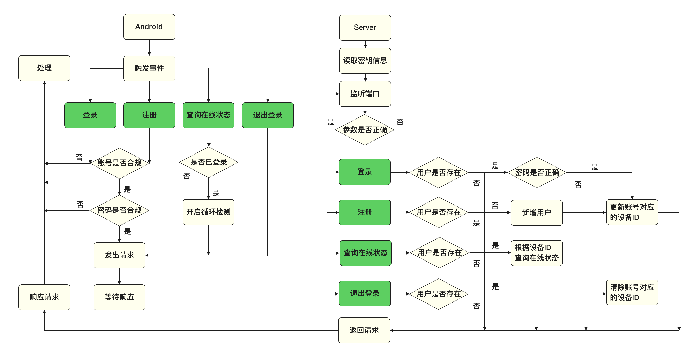

# 单终端登录系统

客户端下载链接：[MyLogin](http://melon-personal.oss-cn-shenzhen.aliyuncs.com/app-release.apk)

## 功能简介

1. 具备注册登录功能
2. 一个⽤户只能在一个设备上登录，切换终端登录时，其他已登录的终端会被踢出

## 技术简介

- 客户端用Android实现，采用Djinni实现跨平台开发（Android & IOS with C++）
- 后台用C++实现
- 采用GPRC进行远程通信，自己生成非对称密钥（crt\key\pem），使用SSL进行数据传输加密
- 采用Bazel构建后台项目，以及依赖管理
- 采用Docker部署项目，并使用Docker Compose编排容器

## 项目架构图

## 项目流程图

## GRPC接口说明
| 接口名  | 含义  | 备注 
|:------|------|------|
| requestUserLogin | 请求登录接口 |  |
| requestUserSign | 请求注册接口 |  |
| requestLogout | 退出登录接口 |  |
| checkConnect | 检查在线状态接口 |  |

## 错误码说明

| 错误码  | 含义  | 备注 
|:------|------|------|
| 0 | 成功 |  |
| -1 | 失败 | 默认 |
| 1010 | pem文件不存在 |  |
| 2000 | 该账号不存在 |  |
| 2001 | 用户密码错误 |  |
| 2002 | 该账号已注册 |  |
| 2003 | 更新账号的token失败 |  |
| 2004 | 新增账号失败 |  |
| 2005 | 该账号在另一端登录 |  |
| 2006 | 用户token不合法 |  |
| 2007 | 初始化密码失败 |  |
| 2008 | 用户token已过期 |  |
| 2009 | 该账号不在线 |  |
| 2010 | 新增账号Session失败 |  |
| 2011 | 接口参数错误 |  |

## 版本说明

|| 模块  | 版本号  | 备注 |
|:--|----|------|------|
| Android端 |  |  ||
|| Android Studio | 3.2.1 | Android IDE |
|| Gradle | 4.6 |  |
|| Android Plugin Version | 3.2.1 |  |
|| GRPC-Android | 1.18.0 |  |
|| protobuf-gradle-plugin | 0.8.6 |  |
| 后端 |  |  ||
|| Ubuntu | 18.04-x86_64 |  |
|| Bazel | 0.20.0 |  |
|| GRPC | 1.18.0 |  |
|| Docker | 18.09.1 | Community |
|| Docker Compose | 1.23.2 |  |

## 常用后端命令
| 命令 | 备注 |
|:--|----|
| bazel build //source:account_server | 构建目标文件 |
| cp ./bazel-bin/source/account_server docker-src/ | 将构建成功的执行文件复制到本地docker目录 |
| docker build -t grpcserver:1.0 . | 在根目录，根据Dockerfile编写的规则，生成服务镜像 |
| docker-compose up grpcserver | 在根目录，根据docker-compose.yml编写的规则，启动并管理容器 |

## 更新日志
### 2019-3-4

##### 客户端

1. 补充参数校验
2. 将网络实现改为 GRPC-C++
3. 将数据存储改为C++实现（key-value，采用读写文件的方式）

##### 服务器端

1. 补充参数校验
2. DB采用Sqlite进行数据存储
3. 用户密码初始化，加密处理
	3-1. 将用户账号进行Sha256消息摘要计算
		salt = Sha256 (account)
	3-2. 将salt与密码合并，获得字符数组，进行MD5计算
	    encrypt_password = MD5 (salt + password)
4. 登录后返回Token
	4-1. 获得加密前Token
		Info = [UID]:[Account]:[随机6位数字]:[生成Token时间（秒）]:[Token过期时间（秒）]
	4-2. 用AES对称算法进行加密处理	
		Toekn = AES ("Info"）
5. 根据Token判断登录状态是否过期
6. 根据Token判断用户是否在线

### 2019-2-10

提交可运行版本1.0，详情可看TAG-1.0.0的README.md
